 

**Systèmes de Recherche d'Information (SRI) **

**‘’Beats’’**

**Master Data Science & Big Data **

**Réalisé Par : **

**Ilyass Bazzi  Examiné par :**  

**Pr.[ ABDELAZIZ ETTAOUFIK**](https://ryepmuqpnz.univh2c.ma/user/view.php?id=18976&course=1)**

 Année Universitaire : 2024/2025 

**L’objectif principal de ce projet est de configurer une plateforme centralisée permettant : **

- **La collecte des journaux et des événements à l’aide d’agents Beats (Auditbeat pour Linux et Winlogbeat pour Windows).** 
- **L’analyse et la visualisation des données collectées à travers une interface utilisateur intuitive fournie par Kibana.** 
- **La  surveillance  des  systèmes  pour  des  cas  d’usage  tels  que  la  sécurité,  la performance, et la conformité.** 

**Introduction**  

**Définition de l’Elastic Stack :** 

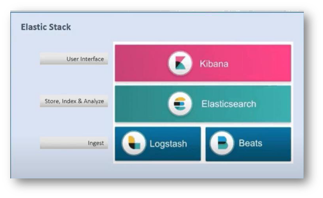

L'Elastic Stack, anciennement connu sous le nom de ELK Stack, est un ensemble d'outils open source développé par Elastic pour la collecte, le stockage, l'analyse et la visualisation des données. Il se compose de plusieurs composants principaux : 

1. **Elasticsearch** : 
- Serveur de recherche et d'analyse distribué. 
- Permet le stockage, l'indexation, et l'analyse des données. 
- Optimisé pour effectuer des recherches rapides et des agrégations complexes sur des jeux de données volumineux. 
2. **Kibana** : 
- Interface utilisateur pour visualiser et interagir avec les données stockées dans Elasticsearch. 
- Permet la création de tableaux de bord personnalisés, l'exploration des journaux et la gestion des données de manière graphique. 
3. **Logstash** : 
- Pipeline de traitement des données utilisé pour collecter, transformer et envoyer les données vers Elasticsearch ou d'autres systèmes. 
4. **Beats** : 
- Une famille de légers agents de collecte de données. 
- Utilisé pour envoyer des journaux et des métriques directement à Elasticsearch ou via Logstash. 

**Beats :** 

**Beats** est un composant essentiel de l'Elastic Stack. Il s'agit d'une suite d'agents légers qui collectent et envoient des données à Elasticsearch ou à Logstash pour une analyse ultérieure. Beats est conçu pour être simple à déployer sur n'importe quelle machine et collecter des données spécifiques à divers cas d'utilisation. 

**Principaux Agents Beats** 

1. **Filebeat** : 
- Collecte et envoie les journaux d'applications, de serveurs, ou de fichiers de logs spécifiques. 
- Convient pour surveiller des fichiers de log continuellement mis à jour, comme les journaux d'applications ou de serveurs web. 
2. **Metricbeat** : 
- Collecte des métriques système ou applicatives (CPU, mémoire, réseau, etc.) et les envoie à Elasticsearch. 
- Peut également surveiller des bases de données ou des serveurs spécifiques comme MySQL, PostgreSQL, et NGINX. 
3. **Auditbeat** : 
- Conçu pour la surveillance de la sécurité et la collecte d'informations d'audit sur les systèmes Linux. 
- Collecte des données comme les accès au fichier, les modifications de configuration système, et les tentatives de connexion. 
4. **Packetbeat** : 
- Analyseur de paquets réseau léger. 
- Surveille le trafic réseau en temps réel et envoie des données sur les protocoles utilisés, la latence, et plus encore. 
5. **Winlogbeat** : 
- Collecte les journaux d'événements Windows et les envoie à Elasticsearch ou Logstash. 
- Idéal pour surveiller les journaux de sécurité, d'application, ou du système sous Windows. 
6. **Heartbeat** : 
- Moniteur de disponibilité utilisé pour vérifier la disponibilité des services et serveurs. 
- Peut surveiller les protocoles HTTP, TCP, ou ICMP pour détecter les interruptions de service. 
7. **Functionbeat** : 
- Conçu pour collecter les journaux des services cloud comme AWS Lambda. 
- Idéal pour les environnements serverless. 

**Rôle des Beats dans le Projet :** 

Dans ce projet, deux **Beats** spécifiques sont utilisés : 

- **Auditbeat** : Surveille les activités des fichiers, des processus, et des utilisateurs sur une machine **Linux**, en fournissant des informations détaillées sur les événements de sécurité et système. 
- **Winlogbeat** : Collecte les journaux d'événements **Windows**, enrichis par **Sysmon**, pour une analyse approfondie des activités sur la machine Windows. 

Ces agents permettent une collecte efficace des données de deux systèmes différents, centralisées dans Elasticsearch, où elles peuvent être visualisées et analysées via Kibana. 

**Étapes d'Installation et de Configuration des Composants Elastic Stack :** 

Commencez par installer Ubuntu en suivant cette vidéo : 

[**https://www.youtube.com/watch?v=v1JVqd8M3Yc** ](https://www.youtube.com/watch?v=v1JVqd8M3Yc)

**Installation d’Elasticsearch :** 

**Étape 1 : Télécharger la clé GPG d’Elasticsearch** 

Copiez cette commande dans le terminal : 

wget -qO - https://artifacts.elastic.co/GPG-KEY- elasticsearch | sudo gpg --dearmor -o /usr/share/keyrings/elasticsearch-keyring.gpg 

Entrez votre mot de passe administrateur si demandé. 

**Étape 2 : Installer le package apt-transport-https** 

Exécutez la commande suivante pour installer le package requis : 

sudo apt-get install apt-transport-https **Étape 3 : Ajouter le dépôt Elasticsearch** 

echo "deb [signed-by=/usr/share/keyrings/elasticsearch- keyring.gpg] https://artifacts.elastic.co/packages/8.x/apt stable main" | sudo tee /etc/apt/sources.list.d/elastic-8.x.list 

**Étape 4 : Installer Elasticsearch** 

Mettez à jour la liste des paquets et installez Elasticsearch : 

sudo apt-get update && sudo apt-get install elasticsearch **Étape 5 : Vérifier l’installation** 

Démarrez le service Elasticsearch : 

sudo service elasticsearch start 

Vérifiez l’état du service : 

sudo service elasticsearch status 

Vous devriez voir quelque chose comme : **Active: active (running) **

**Configuration Alternative** 

appliquez les modifications suivantes : 

1. Ouvrez le fichier de configuration d’Elasticsearch : 

`          `sudo nano /etc/elasticsearch/elasticsearch.yml 

2. Décommentez et modifiez les lignes suivantes : 

**network.host: 127.0.0.1** 

**http.port: 9200** 

**xpack.security.enabled: false** 

3. Enregistrez les modifications et redémarrez le service Elasticsearch : 

`          `sudo service elasticsearch restart 

4. Vérifier l'installation avec curl : 

Pour vérifier si Elasticsearch fonctionne correctement, exécutez la commande suivante dans le terminal : 

curl 127.0.0.1:9200 

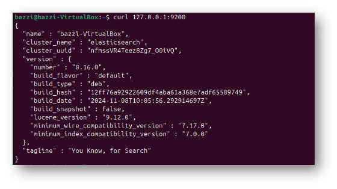

**Configuration pour Autoriser les Connexions Externes à Elasticsearch :** 

Par défaut, **Elasticsearch** est configuré pour fonctionner sur **127.0.0.1** (**localhost**), ce qui signifie qu'il n'accepte pas les connexions depuis l'extérieur. Pour permettre l’envoi de journaux depuis une machine externe (**Windows**, par exemple), nous devons modifier la configuration. 

**Étape 1 : Arrêter le service Elasticsearch** 

Exécutez la commande suivante : 

sudo service elasticsearch stop **Étape 2 : Modifier le fichier de configuration** 

Ouvrez le fichier de configuration d’Elasticsearch : 

sudo nano /etc/elasticsearch/elasticsearch.yml **Étape 3 : Modifier l’adresse réseau** 

1. Recherchez la ligne contenant **network.host**. 
1. Décommentez cette ligne et remplacez 127.0.0.1 par l’adresse IP correcte de votre machine. Pour obtenir cette adresse IP, exécutez la commande suivante : 

ip addr 

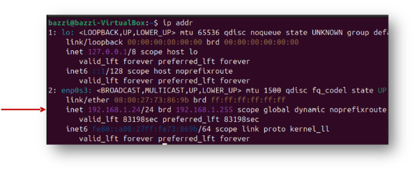

Dans mon cas, c'est **192.168.1.24 ,** donc : **network.host: 192.168.1.24** 

3. Décommentez la ligne contenant discovery.seed\_hosts et configurez-la comme suit : 

`                    `**discovery.seed\_hosts: ["192.168.1.24"]**  # Remplacez par votre adresse IP** 

4. Enregistrez les modifications avec **Ctrl+S** puis quittez avec **Ctrl+X.** 

**Étape 4 : Redémarrer Elasticsearch** 

Redémarrez le service avec la commande : sudo service elasticsearch start 

**Vérification de la Connexion Externe** 

Pour vérifier que le serveur Elasticsearch accepte désormais les connexions externes : 

1. Ouvrez l’invite de commande (cmd) sur votre machine Windows. 
1. Exécutez la commande suivante : 

**curl 192.168.1.24:9200** # Remplacez par votre adresse IP** 

Cette commande doit retourner une réponse similaire à : 

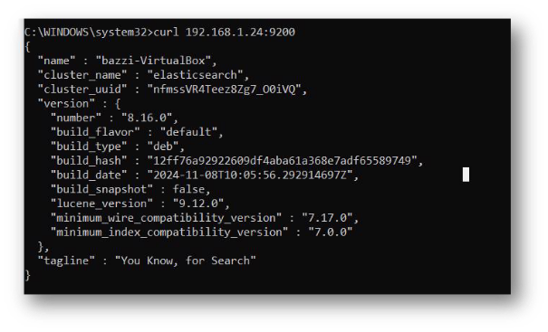

**Installation de Kibana :** 

1\.  Installez Kibana avec la commande suivante : 

sudo apt install -y kibana 

**Installation de Beats** 

Les **Beats** sont des agents qui envoient des journaux et d'autres informations au **Elastic Stack** (**Elasticsearch**, **Logstash**, **Kibana**) pour analyse et visualisation. 

**Étape 1 : Installer Auditbeat** 

Installez **Auditbeat**, un **agent** **Elastic** **utilisé** pour **collecter** et **envoyer** des **données** **d'audit**, y compris des événements système et la surveillance de l'intégrité des fichiers, vers Elasticsearch ou Logstash : 

sudo apt install auditbeat -y 

**Étape 2 : Modifier la configuration de Kibana** 

Après l'installation, vous devez **configurer** **Kibana** pour qu'il **reçoive** les **journaux** des **Beats**. Pour cela, modifiez le fichier de configuration de Kibana : 

sudo nano /etc/kibana/kibana.yml 

Recherchez et décommentez la ligne suivante, puis remplacez l'adresse par celle de votre serveur Elasticsearch : 

**elasticsearch.hosts: ["http://192.168.1.24:9200"]**  # Remplacez par votre adresse IP 

Enregistrez les modifications avec **Ctrl+S** puis quittez avec **Ctrl+X**. 

**Étape 3 :  Modifier le fichier de configuration d'Auditbeat** 

Après avoir installé Auditbeat, vous devez le configurer pour qu'il envoie des données à votre serveur Elasticsearch. Modifiez le fichier de configuration d'Auditbeat : 

sudo nano /etc/auditbeat/auditbeat.yml 

Recherchez la ligne host et modifiez-la pour qu'elle pointe vers l'adresse IP de votre serveur Elasticsearch : 

**host: ["192.168.1.24:9200"]**  # Remplacez par l'adresse IP de votre serveur  

Elasticsearch** 

Enregistrez les modifications avec **Ctrl+S** puis quittez avec **Ctrl+X.** 

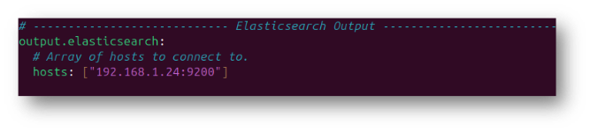

**Étape 4 :  Démarrer Kibana** 

Après avoir configuré Auditbeat, démarrez le service Kibana : 

sudo service kibana start 

**Étape 5 :  Vérification de l'installation** 

Pour vérifier que tout fonctionne correctement, exécutez la commande suivante pour configurer Auditbeat et vérifier la connexion à Kibana : 

**sudo auditbeat -e setup** 

Cela devrait afficher le message suivant : 

`     `**Kibana dashboards successfully loaded** 

**Étape 6 :  Accéder à Kibana** 

Une fois la configuration terminée, vous pouvez accéder à l'interface Kibana en ouvrant votre navigateur et en allant à l'adresse suivante : **[http://127.0.0.1:5601/** ](http://127.0.0.1:5601/)**

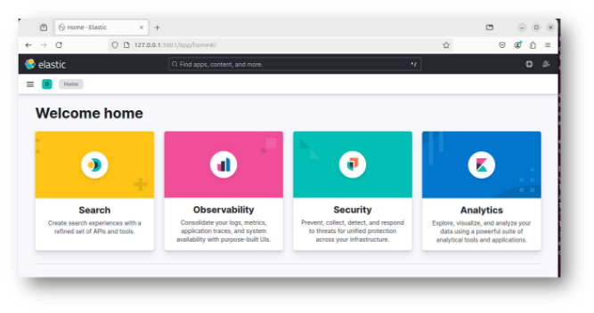

**Configuration de Sysmon :** 

L'intégration des journaux **Sysmon** dans le projet **Beats** améliore la surveillance du système en fournissant des informations détaillées sur l'activité des points de terminaison. Sysmon suit des événements tels que la **création de processus**, les **connexions réseau**, les **modifications de fichiers** et **le chargement de pilotes**, ce qui renforce considérablement la capacité à détecter et à enquêter sur les incidents de sécurité. 

**Étapes d'installation :** 

1. **Télécharger Sysmon** 

   Allez sur[ Microsoft Sysinternals Sysmon ](https://learn.microsoft.com/fr-fr/sysinternals/downloads/sysmon)et téléchargez le fichier zip. Décompressez-le et placez le fichier **Sysmon** dans le répertoire des fichiers de programme (**Program Files**). 

2. **Télécharger et configurer le fichier de configuration** 

   Rendez-vous sur[ GitHub SwiftOnSecurity Sysmon-config ](https://github.com/SwiftOnSecurity/sysmon-config)et téléchargez le dépôt zip. Décompressez-le, copiez le fichier sysmonconfig-export.yml et placez-le dans le dossier **Sysmon** dans **Program Files**. Renommez-le en **sysmonconfig.yml.** 

3. **Exécuter Sysmon** 

   Ouvrez une invite de commande en **mode administrateur** et naviguez vers le répertoire Sysmon : 

cd C:\Program Files\Sysmon 

Exécutez la commande suivante pour installer Sysmon avec la configuration : sysmon -i sysmonconfig.xml -accepteula -h sha256 -l -n 

4. **Vérification de la configuration** 

   Allez dans **Services** et vérifiez si le service **Sysmon** apparaît. 

   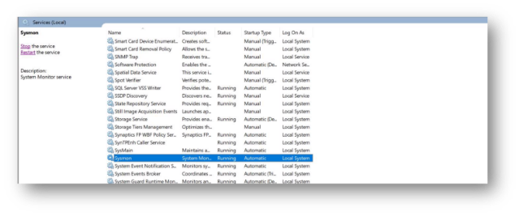

**Installation de Winlogbeat :** 

1. **Télécharger Winlogbeat** 

   Allez sur[ le site officiel de Winlogbeat ](https://www.elastic.co/downloads/beats/winlogbeat)et téléchargez le fichier zip. 

2. **Installation de Winlogbeat** 

   Décompressez le fichier zip dans le répertoire **Program Files**, puis renommez le dossier décompressé en **Winlogbeat** (avec un W majuscule). 

3. **Installation du service Winlogbeat** 

   Ouvrez une fenêtre **PowerShell** en tant qu'**administrateur**. Dans PowerShell, exécutez les commandes suivantes pour installer le service : 

cd 'C:\Program Files\Winlogbeat' .\install-service-winlogbeat.ps1 

4. **Modifier la configuration du service** 

   Allez dans **Services**, recherchez **Winlogbeat**, et modifiez son type de démarrage en **Manuel** au lieu de **Automatique**. Cliquez ensuite sur **Appliquer**. 

   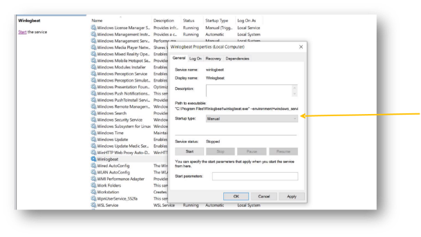

**Configuration de Kibana et démarrage des services :** 

1. **Modifier la configuration de Kibana :**

   Ouvrez le terminal et éditez le fichier de configuration de Kibana : 

sudo nano /etc/kibana/kibana.yml 

Recherchez la ligne **server.host** et modifiez-la pour que l'adresse corresponde à l'adresse IP de votre serveur . 

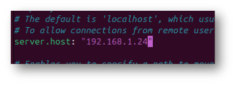

2. **Démarrer Elasticsearch, Kibana et Auditbeat :**

   Lancez les services **Elasticsearch**, **Kibana** et **Auditbeat** avec les commandes suivantes:

sudo service elasticsearch start 

sudo service kibana start sudo service auditbeat start** 

**Connecter Winlogbeat à Elasticsearch:** 

1. **Configurer Winlogbeat :** 

   Allez dans le répertoire de **Winlogbeat** et ouvrez le fichier de configuration **winlogbeat.yml** pour effectuer les modifications suivantes :

- Dans la **section** de configuration de **Kibana**, décommentez la ligne **host** et remplacez localhost par l'adresse IP de votre serveur, par exemple : 

**host: "192.168.1.24:5601"**  # Remplacez par l'adresse IP de votre serveur Kibana 

- Dans la **section** **Elasticsearch** **Output**, changez la ligne **hosts** pour qu'elle corresponde à l'adresse de votre serveur Elasticsearch : 

**hosts: ["192.168.x.x:9200"]**  # Remplacez par l'adresse IP de votre serveur Elasticsearch

2. **Exécuter la configuration de Winlogbeat :** 

   Ouvrez une fenêtre **PowerShell** en tant qu'**administrateur**, puis exécutez la commande suivante pour configurer **Winlogbeat** :

cd 'C:\Program Files\Winlogbeat' .\winlogbeat.exe setup -e

3. **Démarrer le service Winlogbeat :**

   Après avoir configuré **Winlogbeat**, démarrez le service :

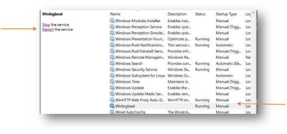

**Accéder à Kibana depuis Windows:** 

1. **Accéder à Kibana :**

   Maintenant, vous pouvez accéder à Kibana depuis Windows en utilisant l'URL suivante **:**

**http://192.168.1.24:5601/**   

**(Remplacez 192.168.1.24 par l'adresse IP de votre serveur Kibana).** 

2. **Naviguer dans Kibana :** 

   Une fois connecté à **Kibana**, **allez** dans le **menu** Découvrir (**Discover**) sur le **côté** **gauche**. Vous y verrez les différents **agents Beats**, tels que **Auditbeat** et **Winlogbeat**.** 

3. **Changer entre les agents Beats :** 

   En haut à **gauche de l'écran**, **dans** la vue des données (**Data View**), vous pouvez **changer** facilement **entre** les **différents agents Beats** pour afficher leurs logs respectifs.** 

**Auditbeat :** 

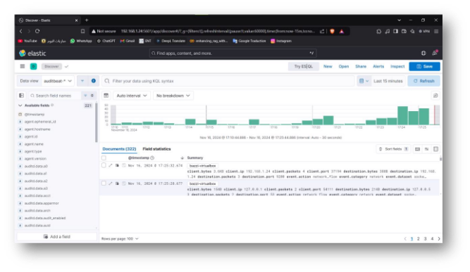

**Winlogbeat:** 

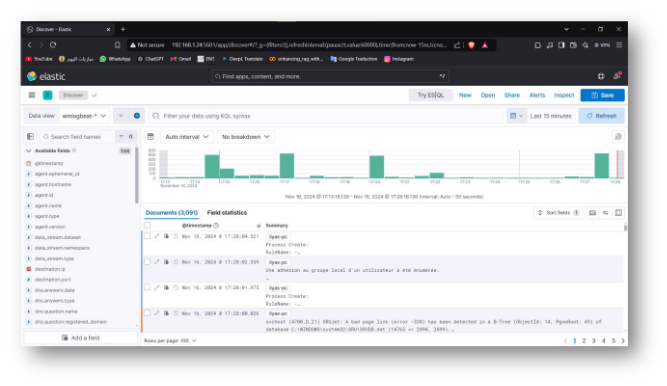

**Extraction d'informations sur l'hôte dans la section sécurité :** 

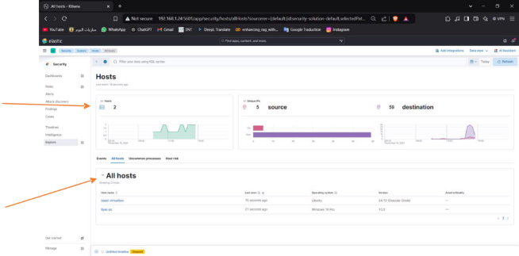

**Créer un tableau de bord :** 

1. **Accéder à la section Tableau de bord :** 

   Allez dans la section Tableau de bord (Dashboard) sous l'onglet Analytique**.** 

2. **Tableaux de bord prédéfinis :** 

   Il existe des tableaux de bord prédéfinis que vous pouvez utiliser, ou vous pouvez créer le vôtre.** 

   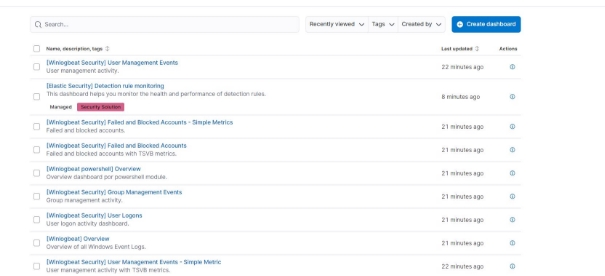

3. **Créer un tableau de bord personnalisé :** 

   Cliquez sur Créer un tableau de bord (Create dashboard).** 

4. **Créer des visualisations :** 

   Ensuite, vous pouvez créer des visualisations personnalisées pour afficher vos données comme vous le souhaitez.** 

   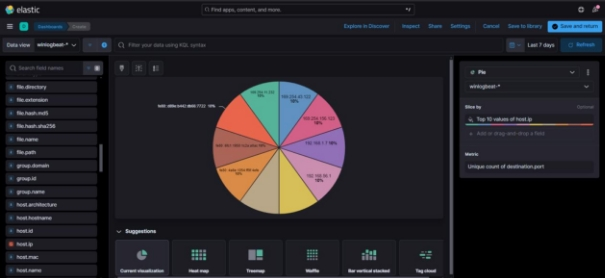

**Exemple d'un tableau de bord personnalisé :** 

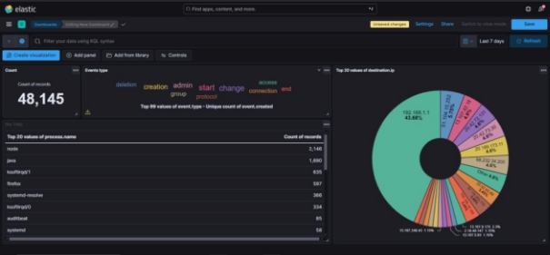

**Vous pouvez aller à : [http://192.168.1.24:5601/app/management/kibana/settings** ](http://192.168.1.24:5601/app/management/kibana/settings)**pour passer en **dark mode** ou voir **les indices Elasticsearch.** 

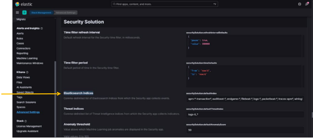
**2024/2025  17** 
